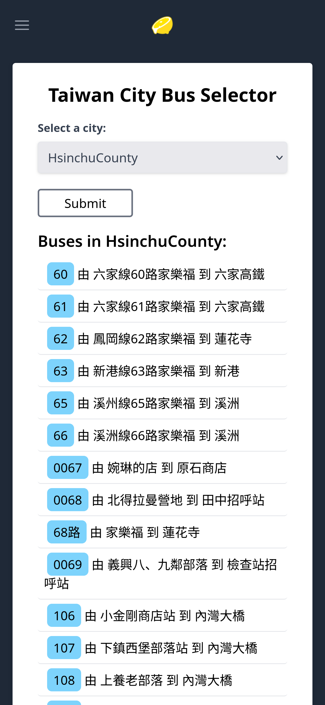
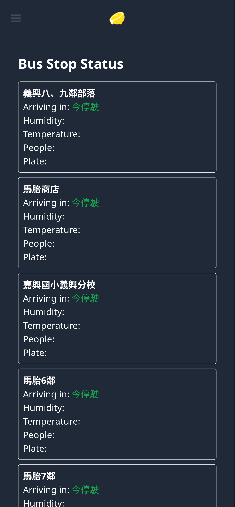
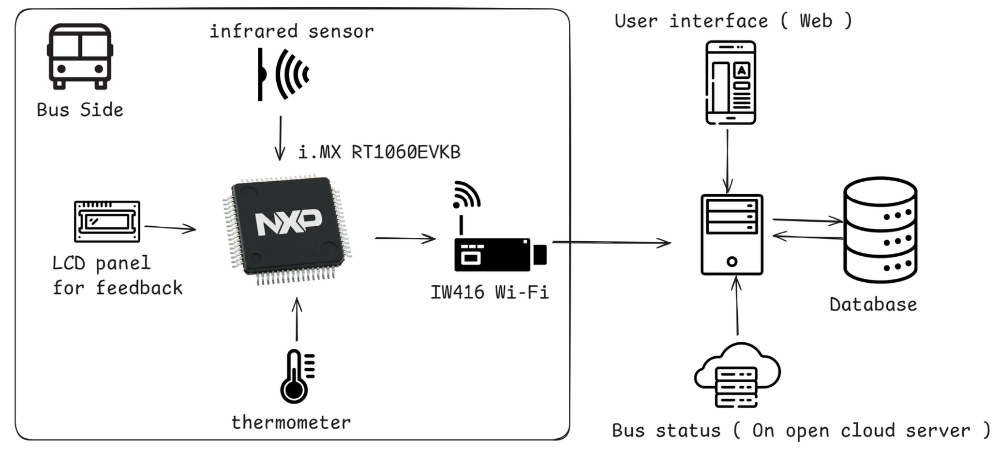

# 2024梅竹黑客松 - 智能公車推薦系統

  * [作品說明](#作品說明)
      * [Screenshot](#Screenshot)
      * [簡報](#簡報)
  * [安裝](#安裝)
  * [程式](#程式)

## 作品說明


### Screenshot

| 選擇城市 | 選擇公車 | 公車資訊 |
|:----:|:-----:|:------:|
|  |  |  | |

### 簡報

[下載](./meichu2024.pdf)

## 安裝

### Web

```shell
cd web
sudo docker build . -t meichu2024
sudo docker run -it meichu2024
```

### imxrt

> Install toolchain first

```shell
cd imxrt
just init
just flash
```

## 程式



- `imxrt`是開發板的程式
- `web`是網站程式

## 技術

|技術|選擇原因|
|:----:|:-----|
|Rust|爽|
|Nuttx|
|Deno|
|Fresh|